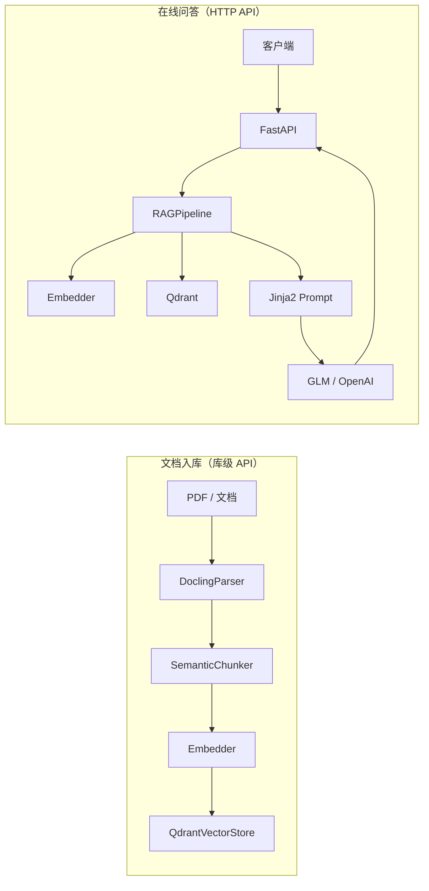

# LLM Doc Parser

[](https://github.com/EricZhang-LK/llm_doc_parser/actions/workflows/ci.yml)
[](https://www.python.org/downloads/)
[](LICENSE)

面向生产环境的 **文档解析 + 向量检索 + RAG 问答** 系统。将 PDF 等复杂文档解析为结构化文本块，经语义分块与向量化后存入 Qdrant，并通过 FastAPI 提供同步与流式（SSE）问答接口。

## 特性

- **高精度文档解析**：基于 [IBM Docling](https://github.com/DS4SD/docling) 解析 PDF，支持表格、公式、多栏排版与 OCR 扫描件
- **语义感知分块**：结构优先、句子边界切分、Token 长度兜底，兼顾检索精度与上下文连贯性
- **可插拔架构**：Embedder、VectorStore、LLM 均通过抽象接口解耦，便于替换供应商或私有化部署
- **生产级向量存储**：Qdrant 适配器内置重试、批处理、确定性 ID 与 Payload 隔离
- **流式 RAG 问答**：SSE 流式输出，降低首字延迟，改善交互体验
- **严格工程质量**：Ruff 静态检查、mypy strict 类型检查、pytest 覆盖率 ≥ 80%、ADR 架构决策记录

## 架构



**RAG 查询链路**：Query Embedding → 向量检索 → Prompt 渲染 → LLM 生成。检索结果为空时直接返回兜底文案，不调用 LLM，以节省成本。

## 技术栈

| 层级 | 技术 | 说明 |
|------|------|------|
| 文档解析 | Docling v2 | 适配器模式封装，CPU 密集任务卸载至线程池 |
| 分块 | SemanticChunker + tiktoken | 中英文句子边界感知 |
| Embedding | 智谱 `embedding-3` / OpenAI `text-embedding-3-small` | 抽象 `BaseEmbedder` |
| 向量库 | Qdrant | 本地内存模式（测试）/ Docker 持久化（生产） |
| LLM | 智谱 GLM / OpenAI GPT | OpenAI 兼容 API，支持流式输出 |
| Web 框架 | FastAPI + Pydantic v2 | 自动生成 OpenAPI 文档 |
| 依赖管理 | uv（Docker）/ pip（本地） | 锁定 `uv.lock` |
| 容器化 | Docker + docker-compose | API + Qdrant 一键编排 |

## 快速开始

### 前置条件

- Python 3.10+
- [Docker](https://docs.docker.com/get-docker/) 与 Docker Compose（推荐）
- 智谱 API Key（[开放平台](https://open.bigmodel.cn/) 申请）

### Docker 部署（推荐）

在项目根目录创建 `.env`：

```env
ZHIPU_API_KEY=your_zhipu_api_key_here
GLM_MODEL=glm-4-flash
ZHIPU_EMBEDDING_MODEL=embedding-3
ZHIPU_EMBEDDING_DIMENSIONS=1024
QDRANT_URL=http://qdrant:6333
```

启动服务：

```bash
docker compose up --build
```

| 服务 | 地址 |
|------|------|
| RAG API | http://localhost:8000 |
| API 文档（Swagger） | http://localhost:8000/docs |
| Qdrant Dashboard | http://localhost:6333/dashboard |

### 本地开发

```bash
# 1. 创建虚拟环境
python -m venv .venv
source .venv/bin/activate        # Linux / macOS
# .venv\Scripts\activate       # Windows

# 2. 安装依赖
pip install -e ".[dev]"

# 3. 配置环境变量
export ZHIPU_API_KEY=your_zhipu_api_key_here
export QDRANT_URL=http://localhost:6333

# 4. 启动 Qdrant（另开终端）
docker run -p 6333:6333 -p 6334:6334 qdrant/qdrant:latest

# 5. 启动 API
python -m llm_doc_parser.api.main
```

## API 参考

### `POST /api/chat`

非流式问答，返回完整答案。

**请求体**

```json
{
  "question": "这份文档的主要内容是什么？",
  "top_k": 3
}
```

**响应体**

```json
{
  "answer": "...",
  "sources": []
}
```

### `POST /api/chat/stream`

流式问答，返回 Server-Sent Events（`text/event-stream`）。

```bash
curl -N -X POST http://localhost:8000/api/chat/stream \
  -H "Content-Type: application/json" \
  -d '{"question": "RAG 是什么？"}'
```

每个事件格式：`data: <token>\n\n`

## 环境变量

| 变量 | 必填 | 默认值 | 说明 |
|------|------|--------|------|
| `ZHIPU_API_KEY` | 是 | — | 智谱 API Key（Embedding + LLM 共用） |
| `GLM_MODEL` | 否 | `glm-4-flash` | 智谱对话模型 |
| `ZHIPU_EMBEDDING_MODEL` | 否 | `embedding-3` | 智谱 Embedding 模型 |
| `ZHIPU_EMBEDDING_DIMENSIONS` | 否 | `1024` | 向量维度（须与 Qdrant collection 一致） |
| `QDRANT_URL` | 否 | `http://localhost:6333` | Qdrant 服务地址 |
| `OPENAI_API_KEY` | 否 | — | 使用 OpenAI 适配器时必填 |
| `OPENAI_MODEL` | 否 | `gpt-4o-mini` | OpenAI 对话模型 |
| `OPENAI_EMBEDDING_MODEL` | 否 | `text-embedding-3-small` | OpenAI Embedding 模型 |

> **说明**：当前 `api/main.py` 默认使用智谱 GLM + 智谱 Embedding。切换至 OpenAI 需取消注释 `OpenAILLM` / `OpenAIEmbedder` 相关代码，或通过环境变量 `LLM_PROVIDER` / `EMBEDDER_PROVIDER` 扩展工厂逻辑。

## 文档入库

HTTP API 目前仅提供问答能力。文档解析与入库通过库级 API 完成，典型流程如下：

```python
import asyncio
from pathlib import Path

from llm_doc_parser.chunker import SemanticChunker
from llm_doc_parser.embeddings.zhipu_embedder import ZhipuEmbedder
from llm_doc_parser.parsers.docling_parser import DoclingParser
from llm_doc_parser.tokenizer import TokenCounter
from llm_doc_parser.vectorstore.qdrant_store import QdrantVectorStore

async def ingest(pdf_path: Path) -> None:
    # 1. 解析
    parser = DoclingParser(enable_ocr=True)
    result = await parser.parse(pdf_path)

    # 2. 语义分块
    chunker = SemanticChunker(counter=TokenCounter())
    chunks = chunker.chunk(result.chunks)

    # 3. 向量化并写入 Qdrant
    embedder = ZhipuEmbedder()
    vectors = await embedder.embed_texts([c.content for c in chunks])

    store = QdrantVectorStore(
        collection_name="documents",
        dimensions=embedder.dimensions,
    )
    await store.upsert(chunks, vectors)

asyncio.run(ingest(Path("docs/sample.pdf")))
```

## 项目结构

```
llm-doc-parser/
├── src/llm_doc_parser/
│   ├── api/              # FastAPI 入口与请求/响应 Schema
│   ├── parsers/          # 文档解析器（Docling 适配器）
│   ├── embeddings/       # Embedding 适配器（智谱 / OpenAI）
│   ├── vectorstore/      # 向量存储（Qdrant / 内存）
│   ├── llm/              # LLM 适配器（GLM / OpenAI）
│   ├── prompts/          # Jinja2 Prompt 模板
│   ├── chunker.py        # 语义分块器
│   ├── rag_pipeline.py   # RAG 编排核心
│   └── models.py         # Pydantic 领域模型
├── tests/                # 单元测试与集成测试
├── docs/adr/             # 架构决策记录（ADR）
├── Dockerfile
├── docker-compose.yml
└── pyproject.toml
```

## 开发与测试

### 代码质量检查

```bash
ruff check src/ tests/
ruff format --check src/ tests/
mypy src/
pytest -m "not integration" --cov=llm_doc_parser --cov-report=term-missing --cov-fail-under=80
```

### 测试分层

| 标记 | 命令 | 说明 |
|------|------|------|
| 单元测试（CI 默认） | `pytest -m "not integration"` | 无需外部服务，CI 强制执行 |
| 集成测试 | `pytest -m integration` | 需下载 Docling 模型，首次运行较慢 |

### Pre-commit

```bash
pip install pre-commit && pre-commit install
pre-commit run --all-files
```

可选：安装 Node 工具链以启用 commitlint（Conventional Commits）：

```bash
npm install
```

## 架构决策

关键技术选型记录在 [`docs/adr/`](docs/adr/)：

| ADR | 主题 |
|-----|------|
| [002](docs/adr/002-docling-parser.md) | Docling 作为默认文档解析引擎 |
| [003](docs/adr/003-semantic-chunking.md) | 语义感知分块策略 |
| [004](docs/adr/004-embedding-vectorstore-abstraction.md) | Embedding / VectorStore 抽象层 |
| [005](docs/adr/005-qdrant-openai-production.md) | Qdrant + OpenAI 生产栈 |
| [006](docs/adr/006-rag-pipeline.md) | Jinja2 Prompt 与 RAG Pipeline |
| [007](docs/adr/007-llm-streaming.md) | LLM 流式输出 |
| [008](docs/adr/008-fastapi-docker.md) | FastAPI + Docker 容器化 |

## 路线图

- [ ] 文档上传 / 入库 HTTP API
- [ ] 检索来源（`sources`）回传至客户端
- [ ] 基于环境变量的 LLM / Embedder 供应商自动切换
- [ ] Rerank 重排序步骤
- [ ] Kubernetes Helm Chart

## 许可证

本项目采用 [MIT License](LICENSE) 开源。
